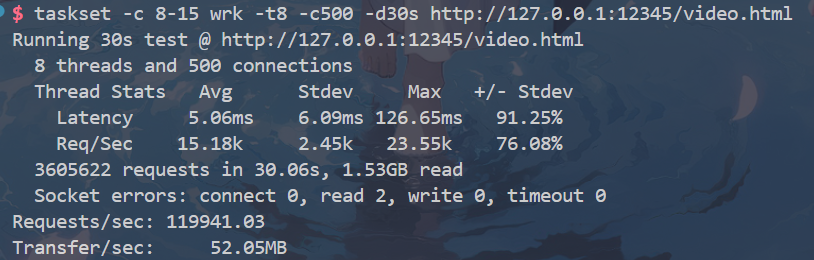
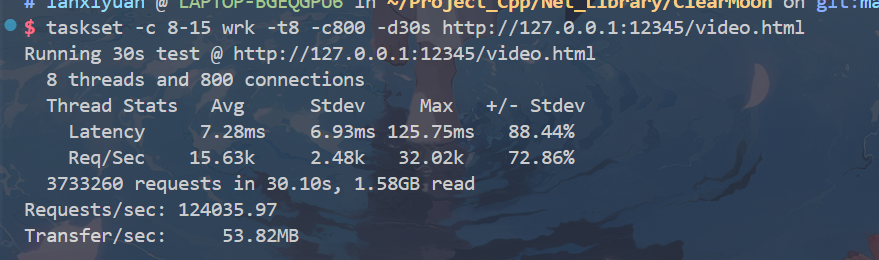
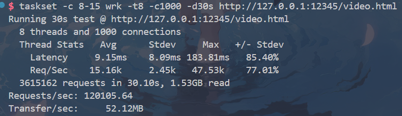

项目名称：ClearMoon网络库 --类muduo网络库  
  
项目介绍：  
基于Reactor多线程模型的高性能C++网络库，自下而上实现了基础组件层、Reactor网络层、HTTP服务层与异步日志系统。内核采用Epoll(LT)事件驱动 + 多IO线程池架构，主线程负责Accept分发，多个IO线程轮询处理读写事件，eventfd实现跨线程唤醒。支持HTTP协议解析与sendfile零拷贝文件传输。
  
使用方法  
前提提要：确保CMake等工具环境已经搭建完成  
  
注：想测试本项目的HTTP协议解析及返回文件类型需在本项目根目录下创建resource目录并在其中自备相应文件  
    
1.CMake构建  
- 在当前项目目录输入 'mkdir build && cd ./build'以创建并移动到build目录,随后输入'cmake .. && make'即可完成项目构建  
2.执行build中的可执行文件 如: 在build目录下输入'./HttpServer_test'即可运行HttpServer  
  
--测试HTTP部分(可选)  
3.打开浏览器输入 '127.0.0.1:12345/FileName.xxx'即可测试 --FileName为自备的文件名，xxx为文件类型  
  
演示GIF  
  
  
------测试------  
注:  
本机CPU: AMD-R7 7745HX(8物理核心/16逻辑核心)  
环境: WSL2 + ArchLinux   
测试工具: wrk  
测试详情: 8核分给服务器，8核分给wrk进行压力测试  
  
使用wrk对html文件请求接口进行压力测试的测试情况  
1.c500 d30  
  
  
2.c800 d30  
  
  
3.c1000 d30  
  